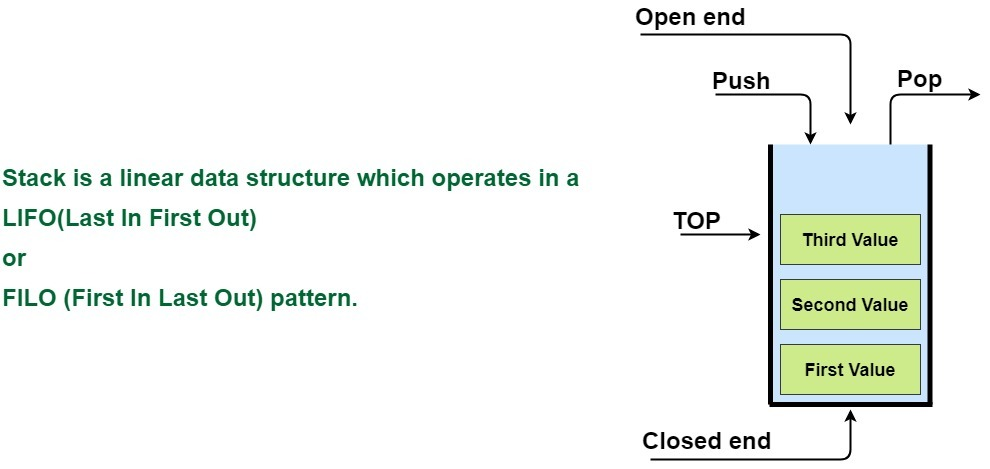

# Stack
Stack is a **linear data structure** which operates in a *LIFO(Last In First Out) or  FILO (First In Last Out)* pattern.
- It is named stack as it behaves like a real-world stack, for example – a deck of cards or a pile of plates, etc.
- Stack is an abstract data type with a bounded (predefined) capacity.
- It is a simple data structure that allows adding and removing elements in a particular order.
- The order may be LIFO(Last In First Out) or FILO(First In Last Out).

# Stack Operations
- push() –  Place an item onto the stack. If there is no place for new item, stack is in overflow state.
- pop() – Return the item at the top of the stack and then remove it. If pop is called when stack is empty, it is in an underflow state.
- isEmpty() –  Tells if the stack is empty or not
- isfull() – Tells if the stack is full or not.
- peek() – Access the item at the i position
- count() – Get the number of items in the stack.
- change() – Change the item at the i position
- display() – Display all items in the stack

# Applications of Stack

1. Balancing of symbols
2. Infix to Postfix /Prefix conversion
3. Redo-undo features at many places like editors, photoshop.
4. Forward and backward feature in web browsers
5. Used in many algorithms like Tower of Hanoi, tree traversals, stock span problem, histogram problem.
6. Other applications can be Backtracking, Knight tour problem, rat in a maze, N queen problem and sudoku solver
7. In Graph Algorithms like Topological Sorting and Strongly Connected Components

# 
[**Back to readme**](../README.md)